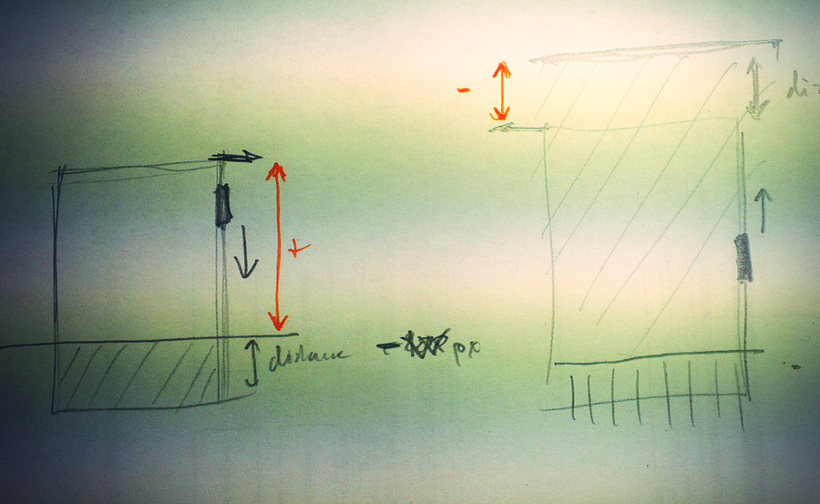

jquery-sectionsnap.js
===========

jQuery plugin that will snap to next section after user scrolles over a HTML single page view, by [Roman Kühl](http://www.kuhl.pl).  

Example
---
Check out the [example](http://kuhl.pl/github/sectionsnap/).  
HTML:    
```html
<script src="jquery.js" type="text/javascript"></script>  
<script src="jquery-sectionsnap.js" type="text/javascript"></script>
<div class="sections-wrapper">
	<div class="section"> ... </div>
	<div class="section"> ... </div>
	<div class="section"> ... </div>
</div>
```  
JS:  
```javascript
$(document).ready(function() {
	$(".sections-wrapper").sectionsnap();
});
```
Options
---
```delay``` time delay (ms)  
```selector``` selector (default ".section")  
```reference``` [0-1] % of window height from which we start snaping (default .9)  
```animationTime``` snap scrolling animation time (ms)  
```offsetTop``` offset top (no snap before scroll reaches this position)  
```offsetBottom``` offset bottom (no snap after bottom - offsetBottom)
JS:  
```javascript
$(document).ready(function() {
	$(".sections-wrapper").sectionsnap({
		delay 			: 100
		, selector 		: '.section'
		, reference 	: 1
		, animationTime : 600
		, offsetTop 	: 100
		, offsetBottom 	: 80
	});
});
```  


